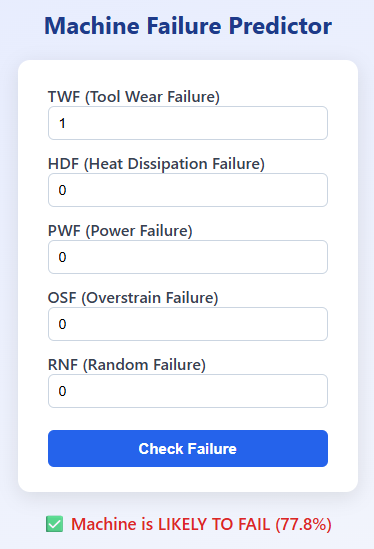

# Machine Failure Prediction Project

## Description of the Problem

This project aims to build a machine learning model capable of
predicting machine failures based on operational and process-related
data. The goal is to anticipate failures before they occur, supporting
preventive maintenance and reducing downtime.

The project was developed as a capstone following best practices in data
preparation, exploratory data analysis, model selection, and
hyperparameter tuning.

### Dataset
The dataset used comes from Kaggle:

**Dataset Source**: [Machine Failure Predictions](https://www.kaggle.com/datasets/dineshmanikanta/machine-failure-predictions/data)

The dataset contains numerical sensor readings and categorical
attributes related to machine operation, along with a binary target
variable indicating machine failure.

### Solution Approach
The project implements a binary classification model using XGBoost, which achieved the best performance among several tested algorithms (Logistic Regression, Decision Tree, Random Forest, and XGBoost). The model can predict engine health with approximately 66.6% accuracy.

## Project Structure

```
├── README.md
├── notebook.ipynb          # EDA and model selection
├── index.html              # Simple web page
├── predict.py              # FastAPI service for predictions
├── Dockerfile              # Container configuration
├── pyproject.toml          # Project dependencies (uv)
├── uv.lock                 # Locked dependencies
├── machine_failure.csv     # Dataset
└── model.bin               # Trained model
```

## Installation and Setup

### Prerequisites
- Python 3.9+
- uv (recommended package manager)

### Installing uv

```bash
# On macOS and Linux
curl -LsSf https://astral.sh/uv/install.sh | sh

# On Windows
powershell -c "irm https://astral.sh/uv/install.ps1 | iex"

# Or using pip
pip install uv
```

### Option 1: Using uv (Recommended)

1. **Clone the repository**
```bash
git clone https://github.com/lmazur75/mlzoomcamp-capstone-project-1
cd mlzoomcamp-capstone-project-1
```

2. **Create virtual environment and install dependencies**
```bash
uv venv
source .venv/bin/activate  # On Windows: .venv\Scripts\activate
uv pip install -r requirements.txt
```

Or install directly from pyproject.toml:
```bash
uv pip sync
```

### Option 2: Using Docker

```bash
docker build --no-cache --progress=plain -t predict-machine-failure .
docker run -p 9696:9696 predict-machine-failure
```

## How to Download the Dataset

1. Visit [Kaggle Dataset Page](https://www.kaggle.com/datasets/dineshmanikanta/machine-failure-predictions/data)
2. Download `machine_failure.csv`
3. Place it in the project root directory

Alternatively, use Kaggle API:
```
import kagglehub

# Download latest version
path = kagglehub.dataset_download("dineshmanikanta/machine-failure-predictions")

print("Path to dataset files:", path)
```

## Usage

### 1. Training the Model

Train the model from scratch:

On Jupyter notebook:
```
Open notebook.ipynb and run all cells.
```

This will:
- Load and preprocess the data
- Train the model with optimized hyperparameters
- Save the model to `model.bin`
- Display training metrics

### 2. Running the Prediction Service

Start the FastAPI server:

```bash
uvicorn predict:app --host 0.0.0.0 --port 9696
```

Or for development with auto-reload:

```bash
uvicorn predict:app --reload
```

The service will be available at:
- API: `http://localhost:9696`
- Interactive docs: `http://localhost:9696/docs`
- Alternative docs: `http://localhost:9696/redoc`

### 3. Making Predictions

#### Using curl:

```bash
curl -X POST http://localhost:9696/predict \
  -H "Content-Type: application/json" \
  -d '{
    "twf": 0,
    "hdf": 0,
    "pwf": 0,
    "osf": 1,
    "rnf": 0,
    "torque_[nm]": 40.0,
    "tool_wear_[min]": 100,
    "air_temperature_[k]": 300.0,
    "process_temperature_[k]": 310.0,
    "rotational_speed_[rpm]": 1500,
    "type": "L"
  }'
```

#### Using Python requests:

```python
import requests

data = {
    "twf": 0,
    "hdf": 0,
    "pwf": 0,
    "osf": 1,
    "rnf": 0,
    "torque_[nm]": 40.0,
    "tool_wear_[min]": 100,
    "air_temperature_[k]": 300.0,
    "process_temperature_[k]": 310.0,
    "rotational_speed_[rpm]": 1500,
    "type": "L"
}

response = requests.post('http://localhost:9696/predict', json=data)
print(response.json())
```

#### Using the Interactive API Documentation:

1. Navigate to `http://localhost:9696/docs`
2. Click on the `/predict` endpoint
3. Click "Try it out"
4. Enter your test data
5. Click "Execute"

#### Response format:

```json
{
  "condition_probability": 0.00017029973969329149,
  "condition": false
}
```

- `condition_probability`: 0 (GOOD) or 1 (BAD)
- `condition`: Human-readable status

## Model Performance

Based on the test set evaluation:

| Model | Test Accuracy | Test F1 | Test ROC-AUC |
|-------|---------------|---------|--------------|
| XGBoost | 0.9980 | 0.9697 | 0.9956
| Decision Tree | 0.9990 | 0.9851 | 0.9886
| Random Forest | 0.9990 | 0.9851 | 0.9837
| Logistic Regression | 0.9990 | 0.9851 | 0.9728

### Feature Importance

The most important features for prediction (XGBoost):
1. **hdf** (29.04%)
2. **osf** (21.65%)
3. **pwf** (21.47%)
4. **twf** (18.37%)

## Docker Deployment

### Build the Docker image:

```bash
docker build --no-cache --progress=plain -t predict-engine-condition .
```

### Run the container:

```bash
docker run -p 9696:9696 predict-engine-condition
```

### Test the deployment:

```bash
curl http://localhost:9696 -UseBasicParsing
```

## API Endpoints

### Root
- **URL**: `/`
- **Method**: GET
- **Response**: Welcome message with API information

### Predict Engine Condition
- **URL**: `/predict`
- **Method**: POST
- **Content-Type**: application/json
- **Request Body**:
```json
{
  "twf": 0,
  "hdf": 0,
  "pwf": 0,
  "osf": 0,
  "rnf": 0,
  "air_temperature_[k]": 300,
  "process_temperature_[k]": 310,
  "rotational_speed_[rpm]": 1538,
  "torque_[nm]": 40,
  "tool_wear_[min]": 108,
  "type": "L"
}
```
### Use index.html for a simple frontend

- Open index.html in your browser and it will send a GET request to http://localhost:9696/predict



### Interactive Documentation
- **Swagger UI**: `/docs`
- **ReDoc**: `/redoc`

## Files and Dependencies

### pyproject.toml
Contains project metadata and dependencies:
```toml
[project]
name = "capstone-project-1"
version = "0.1.0"
description = "Add your description here"
readme = "README.md"
requires-python = ">=3.13"
dependencies = [
    "fastapi>=0.120.0",
    "matplotlib>=3.10.8",
    "numpy>=2.3.4",
    "pandas>=2.3.3",
    "scikit-learn>=1.6.1",
    "seaborn>=0.13.2",
    "uvicorn>=0.38.0",
    "xgboost>=3.1.1",
]

[dependency-groups]
dev = [
    "jupyter>=1.1.1",
]

```

### Dockerfile
Multi-stage build for optimized container size:
```dockerfile
# Use the official Python 3.13.5 slim version based on Debian Bookworm as the base image
FROM python:3.13.5-slim-bookworm

# Copy the 'uv' and 'uvx' executables from the latest uv image into /bin/ in this image
# 'uv' is a fast Python package installer and environment manager
COPY --from=ghcr.io/astral-sh/uv:latest /uv /uvx /bin/

# Set the working directory inside the container to /code
# All subsequent commands will be run from here
WORKDIR /code

# Add the virtual environment's bin directory to the PATH so Python tools work globally
ENV PATH="/code/.venv/bin:$PATH"

# Copy the project configuration files into the container
# pyproject.toml     → project metadata and dependencies
# uv.lock            → locked dependency versions (for reproducibility)
# .python-version    → Python version specification
COPY "pyproject.toml" "uv.lock" ./

# Install dependencies exactly as locked in uv.lock, without updating them
RUN uv lock && uv sync --locked

# Copy application code and model data into the container
COPY "predict.py" "model.bin" ./

# Expose TCP port 9696 so it can be accessed from outside the container
EXPOSE 9696

# Run the application using uvicorn (ASGI server)
# predict:app → refers to 'app' object inside predict.py
# --host 0.0.0.0 → listen on all interfaces
# --port 9696    → listen on port 9696
ENTRYPOINT ["uvicorn", "predict:app", "--host", "0.0.0.0", "--port", "9696"]
```

## Development

### Setting up development environment with uv

```bash
# Create virtual environment
uv venv

# Activate virtual environment
source .venv/bin/activate  # Linux/macOS
# or
.venv\Scripts\activate  # Windows

# Install dependencies
uv pip install -r requirements.txt

# Install development dependencies
uv pip install jupyter matplotlib seaborn
```

### Running the Jupyter Notebook

```bash
jupyter notebook notebook.ipynb
```

The notebook contains:
- Data loading and exploration
- Feature analysis and visualization
- Model comparison and selection
- Hyperparameter tuning with GridSearchCV
- Final model evaluation

### Project Workflow

1. **Data Preparation** (`notebook.ipynb`)
   - Load dataset
   - Clean column names
   - Check for missing values
   - Split into train/test sets

2. **EDA and Feature Analysis** (`notebook.ipynb`)
   - Statistical summary
   - Feature importance analysis
   - Visualization of key features

3. **Model Selection** (`notebook.ipynb`)
   - Test multiple algorithms
   - Hyperparameter tuning with GridSearchCV
   - Cross-validation with StratifiedKFold
   - Select best performing model (XGBoost)

4. **Model Training** (`model.bin`)
   - Train final model with best parameters
   - Save model to disk

5. **Deployment** (`predict.py`, `Dockerfile`)
   - FastAPI service for real-time predictions
   - Docker containerization

**Note**: This project is for educational and demonstration purposes. For production use, additional testing, validation, and monitoring should be implemented.